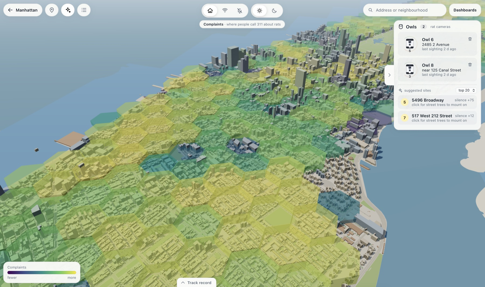
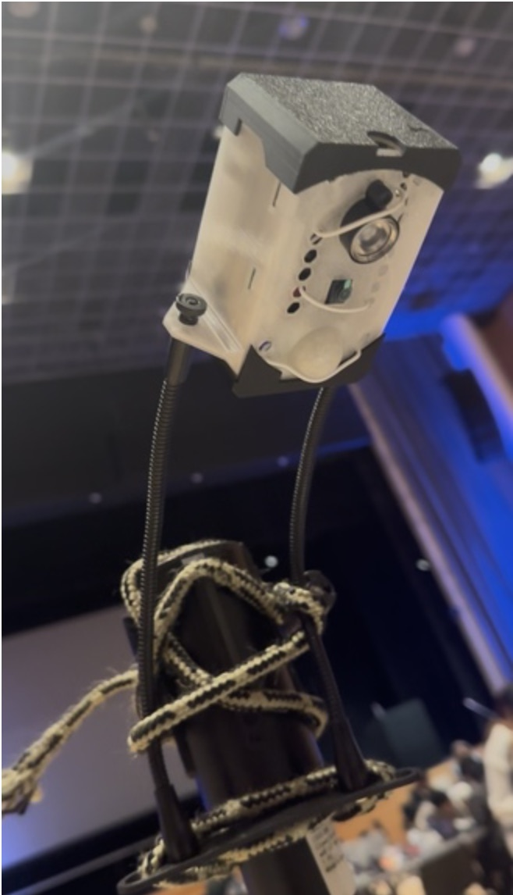
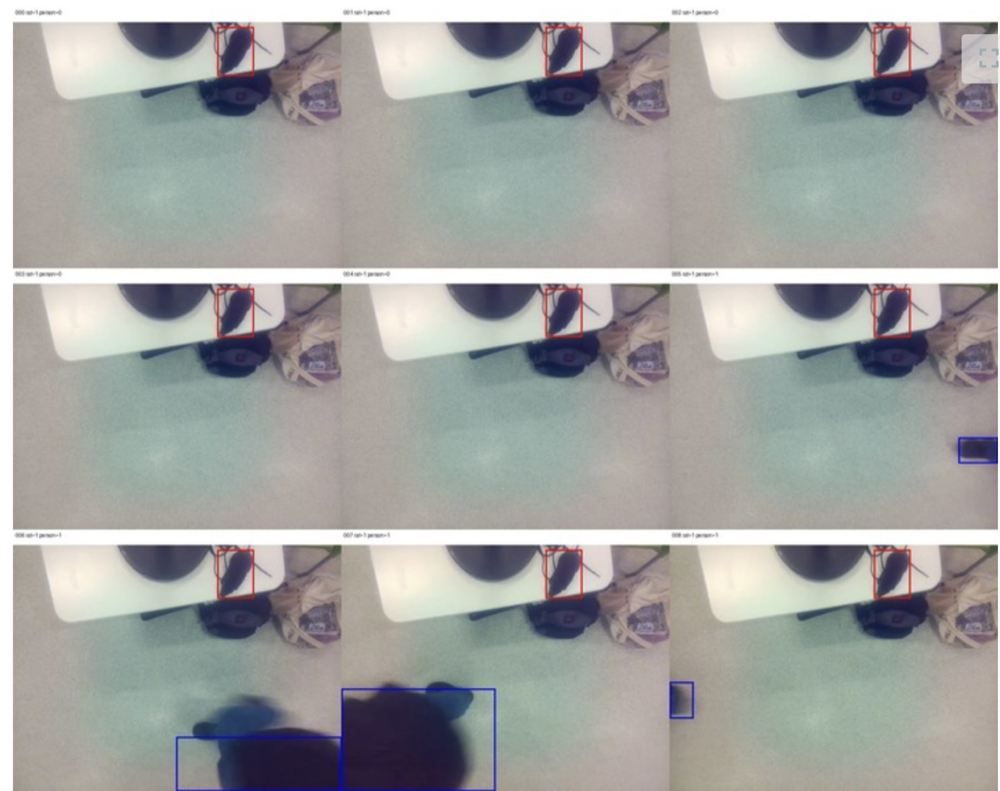

<div align="center">

# NightOwl

**Predicting where New York's rats are, not just where people complain.**

[](https://barn-owl.tech)
[](pitch/README.md)
[](docs/utsav-technical-handoff.md)
[](#limitations)


</div>



## Overview

NYC estimates about 3 million rats and runs ~152,000 initial rodent inspections a year, targeted mostly by 311 complaints. Yet these inspections focus on the callees rather than actual rat populations themselves -> the richest fifth of blocks files 76% more complaints per rat found than the poorest fifth, which has 51% more infestations.

NightOwl scores every block-sized cell in the city each month, flags the blocks that are likely ratty but quiet, and places a low-cost camera node, an **Owl**, where the model is least certain. Owl sightings flow back into the map and rerank the next placements.

## How it works

- **Model A (human feedback)** predicts complaints from 512k 311 rodent complaints and 3.1M DOHMH inspection records.
- **Model B (environment)** predicts the share of swept lots with active rat signs from 26 physical features over ten years of open data. 
- **Silence score** = Model B percentile − Model A percentile. High where rats are likely despite no 311 callees.
- **Planner** ranks sensor sites on real street trees; a building model ranks most likely rat infested areas.
- **Feedback loop.** An accepted Owl sighting updates the cell's Beta posterior and reranks sites. 

Both are LightGBM models trained from scratch in [model/](model/README.md).

## Results

Rolling backtest, 119 months (2016-01 → 2026-08), top 50 cells scored on lots the city swept that month:

| Picking strategy | Swept lots with rat signs |
|---|---:|
| **Model B** | **19.5%** (best in 108 / 119 months) |
| Most 311 complaints | 15.2% |
| Rats found before | 17.1% |
| Quiet blocks: Model B vs random | **15.6% vs 8.8%** (117 / 119 months) |

Model B AUC on held-out community districts: **0.633**

## Owl node

<p align="center"></p>

Raspberry Pi 5, IMX219 NoIR camera, 850 nm IR illuminator, HC-SR501 PIR, PiSugar battery, printed enclosure ([build files](model/enclosure/README.md)). The PIR wakes the camera on motion and heat; a YOLO11n detector fine-tuned on reviewed footage decides on-device. Only the event (timestamp, cell, confidence, small crop) goes to the local API. No video is stored or uploaded!



## Dashboards

`/dashboards` turns a question into validated charts through a Grok tool loop over seven datasets: the model month, sites, backtest, Owl events, and 16 years of NYC Open Data complaints and inspections by borough, ZIP area and ACS income band. Every chart names its source.

## Installation

```sh
cp .env.example .env          # add XAI_API_KEY for the dashboard assistant
pnpm --dir web install --frozen-lockfile
```

## Quick start

```sh
./api/run.sh                  # API on :8000 (restart after editing api/)
pnpm --dir web dev            # map on http://localhost:5173
```

Without the API the map shows labeled fixture data. Refresh the open-data history with `./data/fetch_history.py`. Checks:

```sh
uv run --project api pytest -q api/tests
pnpm --dir web build && pnpm --dir web lint
```

## Limitations

- The detector was trained on a room-lit plush rat. Infrared footage and wild rats are untested. Its fresh box test scored 0.616 rat AP50 ([fresh test](vision/V5_FRESH_RESULTS.md), [event test](vision/V5_FORMAL_EVENT_RESULTS.md)).

## Repository

| Path | Contents |
|---|---|
| [web/](web/README.md) | React + three.js map, dashboards UI |
| [api/](api/README.md) | FastAPI, event store, posterior updates, dashboard tool loop |
| [model/](model/README.md) | Cell features, Models A/B, planner, backtest, enclosure |
| [data/](data/README.md) | Open-data bake and dashboard history fetch |
| [vision/](vision/RUNBOOK.md) | Detector training, evaluation, Pi runtime |
| [city/](city/README.md) | H3 fixtures and 3D city bake |
| [pitch/](pitch/README.md) | Deck, script, evidence receipts |

## Acknowledgements

NYC Open Data (311, DOHMH rodent inspections, PLUTO, DSNY, DOB), US Census ACS, NOAA, [H3](https://h3geo.org), [LightGBM](https://github.com/microsoft/LightGBM), [Ultralytics YOLO11](https://github.com/ultralytics/ultralytics), [three.js](https://threejs.org). The project was previously named Barn Owl; that name survives only in Pi paths and the `barn-owl.tech` domain.
