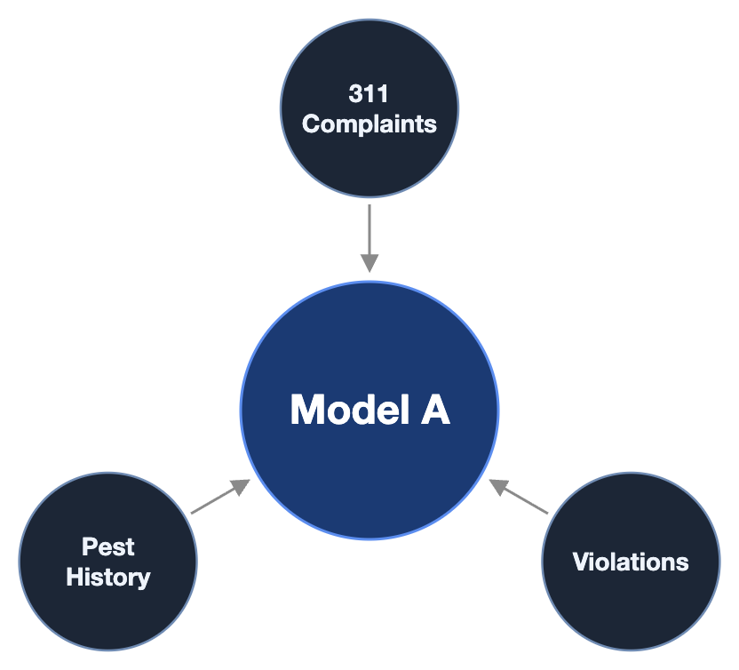
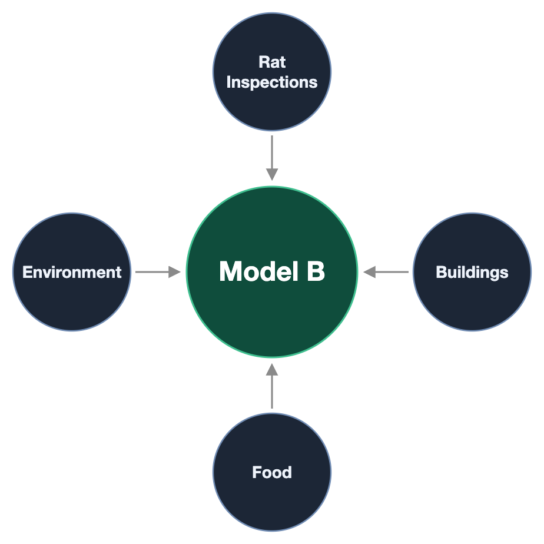
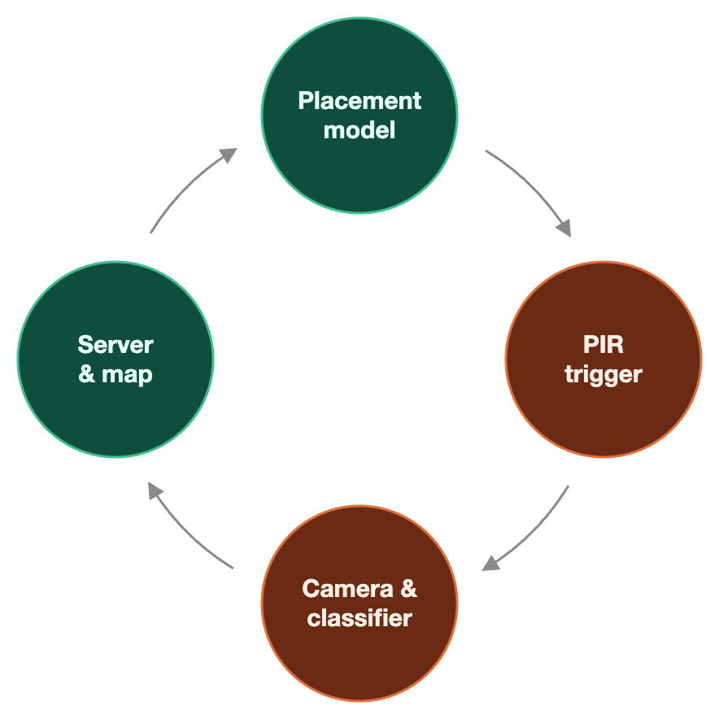

<div align="center">

# NightOwl

**NYC's automated rat surveillance system**

[](https://barn-owl.tech)
[](pitch/README.md)
[](docs/utsav-technical-handoff.md)
[](#limitations)


</div>


## Rats?

NYC estimates about 3 million rats and runs ~152,000 initial rodent inspections a year, targeted mostly by 311 complaints. Yet these inspections focus on the callees rather than actual rat populations themselves -> the richest fifth of blocks files 76% more complaints per rat found than the poorest fifth, which has 51% more infestations. 

NightOwl scores every block-sized cell in the city each month, flags the blocks that are likely rat-infested but quiet, and places a low-cost camera node, an **Owl**, where the model is least certain. Owl sightings flow back into the map and rerank the next placements.

## How we find rats

<table>
  <tr>
    <td width="50%" align="center"></td>
    <td width="50%" align="center"></td>
  </tr>
  <tr>
    <td colspan="2" align="center"></td>
  </tr>
</table>

This project can be separated into two core parts: two gradient-boosted models for location prediction, and a sensor node (Owl).

## Location Prediction**

Gradient boosting is helpful in our context because rat infestations can stem from a lot of potential environmental factors (ie. poor trash collection record, many restaurants with safety violations), and these factors combine in ways a simple linear model misses. For example, a logistic regression baseline scored 0.567 AUC, which pales in comparison our boosted model's 0.633. Through this way, we can learn which conditions actually predict rats without hand-setting a weight for each one.

We separated location prediction between two models: A, and B. 

- Model A takes 311 rat complaints, past complaint history, and HPD rodent violations, and predicts how many rat complaints each cell will get that month. It aims to predict rats based only on what people see, and nothing more.\n
- Model B takes 26 physical features per cell: building height and age, district trash tonnage, DSNY bin rules, street trees, and weather, with income and population as controls. It's trained on the share of lots where inspectors found rats during sweeps. It aims to predict based only on what the environment is actually like.

This separation of responsibilities allows us to compare where people complain against where rats likely are, and flag "silent" blocks where Model B expects rats but Model A doesn't expect calls.

To test these models, we ran a rolling backtest over 119 months (2016-01 -> 2026-08). Each month, we train on the months before it, and compare its predictions with actual rat inspection findings in NYC Open Data. We only score lots the city swept that month. This is because DOHMH sweeps inspect every lot on a block whether anyone complained or not, so the comparison isn't biased toward blocks that call more.

Backtesting results:

| Picking strategy | Swept lots with rat signs |
|---|---:|
| **Model B** | **19.5%** (best in 108 / 119 months) |
| Most 311 complaints | 15.2% |
| Rats found before | 17.1% |
| Quiet blocks: Model B vs random | **15.6% vs 8.8%** (117 / 119 months) |

## Owl node

<p align="center"></p>

Our node sensor consists of a Raspberry Pi 5, IMX219 NoIR camera, 850 nm IR illuminator, HC-SR501 PIR, PiSugar battery, printed enclosure ([build files](model/enclosure/README.md)). 


The camera only wakes up upon heat or motion direction through the PIR, and once on, our fine-tuned YOLO11n detector decides on-device. Through local classification, only the event (timestamp, cell, confidence, small crop) goes to the local API, and no video is stored or uploaded. We respect the privacy of New Yorkers, and the last thing they'd like are cameras everywhere - these node sensors can physically only record rats!

**Why can't we just stick with inspectors?**

As mentioned prior, NYC funds over 150,000 inspections. When multiplied by the average NYC Health Sanitarian salary (~$35/hr), this comes down to $5.25 million dollars spent just on inspections every year. 

A production node sensor running on XIAO ESP32S3 costs ~$30 to make, and can run for years (in 6 week intervals to recharge). Each sensor covers a 1.5 m<sup>2</sup> radius. Combined with the location prediction model, sensors can be placed in actual rat routes and eventually traced back to their burrows to be passed to DOHMH. 

Effectively, one Owl costs less than an hour of inspector work, is on 24/7, and lasts degrees of magnitude longer. The NYC's budget of $5M per year, they'd be able to place down 160,000 owl nodes around the city, all of which return feedback to enhance the next generation of placement nodes.

## Installation

```sh
cp .env.example .env          # add XAI_API_KEY for the dashboard assistant
pnpm --dir web install --frozen-lockfile
```

## Quick start

```sh
./api/run.sh                  # API on :8000 (restart after editing api/)
pnpm --dir web dev            # map on http://localhost:5173
```

Without the API the map shows labeled fixture data. Refresh the open-data history with `./data/fetch_history.py`. Checks:

```sh
uv run --project api pytest -q api/tests
pnpm --dir web build && pnpm --dir web lint
```

## Limitations

- The detector was trained on a room-lit plush rat. Infrared footage and wild rats are untested. Its fresh box test scored 0.616 rat AP50 ([fresh test](vision/V5_FRESH_RESULTS.md), [event test](vision/V5_FORMAL_EVENT_RESULTS.md)).

## Repository

| Path | Contents |
|---|---|
| [web/](web/README.md) | React + three.js map, dashboards UI |
| [api/](api/README.md) | FastAPI, event store, posterior updates, dashboard tool loop |
| [model/](model/README.md) | Cell features, Models A/B, planner, backtest, enclosure |
| [data/](data/README.md) | Open-data bake and dashboard history fetch |
| [vision/](vision/RUNBOOK.md) | Detector training, evaluation, Pi runtime |
| [city/](city/README.md) | H3 fixtures and 3D city bake |
| [pitch/](pitch/README.md) | Deck, script, evidence receipts |

## Acknowledgements

NYC Open Data (311, DOHMH rodent inspections, PLUTO, DSNY, DOB), US Census ACS, NOAA, [H3](https://h3geo.org), [LightGBM](https://github.com/microsoft/LightGBM), [Ultralytics YOLO11](https://github.com/ultralytics/ultralytics), [three.js](https://threejs.org). The project was previously named Barn Owl; that name survives only in Pi paths and the `barn-owl.tech` domain.
