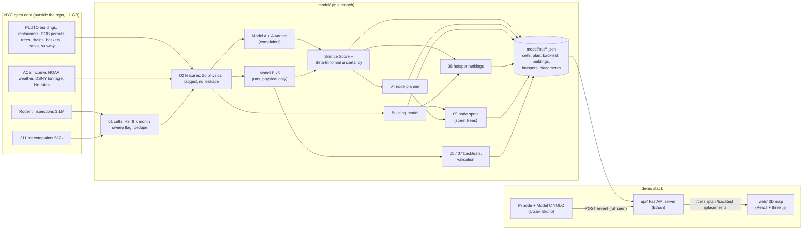

# model/ — where are the rats nobody reports?

Sanjavan's node-location pipeline for NightOwl. Written on 2026-09-26 (event day). Last updated **Sat 23:31** (plain-language accuracy for Models A and B).

**Contents:** [In one minute](#in-one-minute) · [The models](#the-models) · [Architecture](#architecture) ·
[For teammates](#for-teammates-start-here) · [Headline results](#headline-results) · [Accuracy](#model-accuracy-plain-language) · [Honest limits](#honest-limits-say-these-before-a-judge-does) ·
[Q&A for judges](#qa-for-judges) · [Pipeline](#pipeline) · [Key decisions](#key-decisions) ·
[Research](#research-and-sources-we-relied-on) · [Data sources](#data-sources) · [Glossary](#glossary) ·
[Ethics](#ethics-and-privacy) · [Future work](#future-work)

## In one minute

NYC finds rats mostly through 311 calls, so its rat map is really a map of who calls. This branch builds the part
that finds **where the city isn't looking**: it learns where rats *should* be from physical conditions (old low-rise
buildings, trash, restaurants, construction, bin rules), compares that with where people *complain*, and flags the
**silent blocks** (rats likely, few calls). Then it ranks NYC hotspots, picks where to put sensor nodes (down to a
specific street tree), and lists which buildings to inspect first. On 10 years of real inspections it finds **28%
more rats** than "go where people complain", and on quiet blocks **1.8× more than chance**.

## The models

| # | Name | Type | What it does, in plain words | File |
|---|---|---|---|---|
| 1 | **Model A: "what the city sees"** | LightGBM, Poisson | Predicts how many rat complaints an area gets: the city's current picture | `03_models.py` |
| 2 | **A-variant** | LightGBM, Poisson | Model A limited to Model B's physical features, so the comparison is fair | `03_models.py` |
| 3 | **Model B: "what's actually there"** | LightGBM, 5 bootstrap copies | Chance an inspector finds rats in an area, from physical facts only, never complaints. If the 5 copies disagree, we're unsure | `03_models.py` |
| 4 | **Silence Score** | percentile math | Model B's rank minus the complaints-per-resident rank. High = rats likely, nobody calling | `03_models.py` |
| 5 | **Beta-Binomial update** | Bayesian statistics | Starts from Model B's guess; inspections and sensor detections move it. Also measures how much is still a guess | `03_models.py`, `api/posterior.py` |
| 6 | **Building model** | LightGBM | Same idea per building (age, floors, homes, type, restaurant): which door to knock on first | `lots.py`, `06_buildings.py` |
| 7 | **Node planner** | greedy rule | 20 sensor sites: likely rats × little data, spread out, snapped to a real street tree | `04_optimizer.py` |
| 8 | **Node spot scorer** | weighted rule (hand-set weights) | Inside a hexagon, ranks ~50 m spots for the node: sightings, rats found, risky buildings, food, drains | `09_placements.py` |
| – | Logistic regression | baseline | Only a sanity check: Model B has to beat it (0.633 vs 0.567 AUC) | `03_models.py` |
| 9 | Model C: rat detector (Utsav) | YOLO11n on the Pi | Sees a rat on the night camera, sends `POST /event`, which feeds #5 | `vision/` |

### How they connect

```
Model A + Model B        →  Silence Score            →  which AREAS are silent            (map colours)
Model B + "how unsure"   →  Node planner             →  WHERE to put sensors              (pins 1..20)
Node spot scorer         →  inside each ranked area  →  WHICH street tree to mount on     (green pins A/B/C)
Building model           →  inside each ranked area  →  WHICH building to inspect first   (building list)
Model C on the Pi        →  "rat seen!" POST /event  →  Beta-Binomial update → map recolours (live demo)
```

In one line: A and B find **where the city isn't looking**, the planner and spot scorer decide **where to put
sensors**, the building model says **which door to knock on**, and the detector **proves it with a real sighting**.

## Architecture



**The loop in words:** open data → cells and features → Model A (complaints) and Model B (rats) → silence and
uncertainty → rankings, sensor sites, spots, building lists → `model/out/*.json` → Ethan's server → the map. When the
node on the Pi sees a rat, it posts an event; the server updates that hexagon's Beta-Binomial estimate and the map
recolours. That's the feedback loop: the sensor turns a ranking into evidence.

## For teammates: start here

### What this branch has (`sanjavan/model`)

| Piece | Status | Where |
|---|---|---|
| Data pipeline: every NYC H3 r9 cell × month since 2010, sweep flag, complaint dedupe | done | `01_build_cells.py`, `02_features.py` |
| Model A (complaints), Model B (rats, physical features only), Silence Score, uncertainty | done | `03_models.py` |
| Backtest on real sweeps, 119 months: +28% more rats than "go where people complain" | done | `05_backtest.py` → `out/backtest.json` |
| Validation: quiet ≠ rat-free, out-of-time check, binning before/after | done | `validate_silence.py`, `binning_effect.py` |
| Node planner: 20 sites on real tree pits | done | `04_optimizer.py` → `out/plan.json` |
| Building list: top 5 buildings to inspect per silent block / node site | done | `06_buildings.py` → `out/buildings.json` |
| Hotspot rankings: top 10 risk / silent, top-1% tiers, neighborhoods | done | `08_hotspots.py` → `out/hotspots.json` |
| **Node spots inside each hexagon**: 3 mount options (street trees, ~50 m spots) per ranked hexagon | done | `09_placements.py` → `out/placements.json`, `GET /placements?h3=` |
| Map JSON in the `api/` + `web/` contract | done | `export.py` → `out/cells.json`, `out/plan.json` |
| Map: "NYC hotspots" panel, click flies in + opens popup, minimize buttons, popup shows neighborhood + tier | done | `web/src/components/Hotspots.tsx` + small edits (below) |

### What each of you gets from this branch

**Ethan (api/, web/, deck)**
- `api/` works unchanged with these files: it reads `model/out/cells.json`, `plan.json`, `backtest.json` first
  and only falls back to the fixtures if they're missing. Tested: one fake event on the demo cell moves `score_b`
  0.038 → 0.118.
- **Please use this `out/backtest.json`, not the one scored on all inspections.** Scoring on all T+1 inspections
  makes silent picks look 24× worse than 311, because silent blocks are rarely inspected. This one scores only on
  cells that were swept that month.
- `web/` edits on this branch (heads-up before merging): new `components/Hotspots.tsx`; small edits to `App.tsx`
  (hotspots panel, pinned popup, node spots), `city/scene.ts` (focus now zooms in, `FOCUS_DISTANCE = 900`),
  `components/CellPopup.tsx` (where / hotspot rows), `components/EventFeed.tsx` (minimize), `components/Header.tsx`
  (subtitle), `index.css`, `types.ts` (optional ranking fields). Typecheck and `npm run build` pass.
- Asks: the **Rat Mitigation Zone polygons** (`rmz` is null in `cells.json` until then); one owner for `model/out/`
  (both branches write `cells.json`, `plan.json`).

**Utsav (detector / YOLO)**
- The only link to the model is `POST /event` on `api/`. Body (`api/main.py`, extra keys rejected):
  `{node_id, h3, ts, class: "rat"|"person", conf 0-1, n_hits, bbox [x,y,w,h] 0-1, crop_b64, fw}`.
  The posterior only moves when `conf >= 0.5` and `n_hits >= 3`. Test without the Pi: `./api/fake_event.sh`.
- **Demo cell:** `892a100d2c3ffff` (27th & 6th, the current `DEMO_H3` in `vision/pi/detect.py` and
  `city/make_fixture.py`) is **not silent in the real data** (silence −7). Real silent cells inside the 3D map area:

  | h3 | where | lat, lon | silence | P(rats) | complaints/yr |
  |---|---|---|---|---|---|
  | **`892a1072c37ffff`** (suggested) | **Chinatown-Two Bridges (CD 103)** | 40.7153, -73.9951 | +56 | 7.3% | **0** |
  | `892a10728bbffff` | Financial District-Battery Park City (CD 101) | 40.7044, -74.0075 | +72 | 5.1% | 6 |
  | `892a107289bffff` | Tribeca-Civic Center (CD 101) | 40.7123, -74.0099 | +69 | 4.9% | 0 |

  Chinatown-Two Bridges fits the pitch hook (Manhattan CD 3). Changing it = the `DEMO_H3` constant in both files.
- Training-data notes: grayscale for training and on the Pi (removes the NoIR tint); split train/val by clip, ideally
  hold out a whole floor type; 1 fps (frames in a clip are near-duplicates); hard negatives incl. hands, shoes, bags,
  cables and a hand pushing the rat (label only the rat); hand-check every empty pre-label on rat clips; gate on
  events (fires within 1 s per push, false events per 10 min), not mAP.

**Bruno (Pi / hardware)**: nothing to change for the model. Test the Pi on Columbia wifi early (login pages or
device isolation would block `POST /event`); phone hotspot as backup.

### How to use this branch

```
git fetch origin && git checkout sanjavan/model
```

**See the map with the real model output** (two terminals, from the repo root):
```
python3 -m uvicorn main:app --app-dir api --port 8000      # server (needs: pip install fastapi "uvicorn[standard]" pydantic)
cd web && npm install && npm run dev                        # map at http://localhost:5173 ("API: live" = real data)
./api/fake_event.sh                                         # optional: fake rat event on the demo cell
curl -X DELETE -H 'X-Demo-Reset: yes' localhost:8000/events # reset events between rehearsals
```
The committed `model/out/*.json` files are enough for this. No data download needed.

**Re-run the model** (only if you change it): needs the raw data in `../../data/raw/` next to the repo (≈1 GB,
NYC Open Data + Census/NOAA; list and pull method in `data/DATA_DICTIONARY.md` of the project folder, or set
`DATA_DIR=...`) and `pip install pandas duckdb h3 geopandas shapely lightgbm scikit-learn scipy`. Then:
```
python3 model/01_build_cells.py && python3 model/02_features.py && python3 model/03_models.py \
  && python3 model/04_optimizer.py && python3 model/05_backtest.py && python3 model/export.py \
  && python3 model/06_buildings.py && python3 model/08_hotspots.py && python3 model/09_placements.py
```
About 5 minutes on an M-series Mac (the backtests are the slow part).

## Headline results

| Claim | Number | Where |
|---|---|---|
| **Backtest: our picks beat "go where people complain"** | **19.5% vs 15.2%** of swept lots had rats (+28%), won **108 of 119 months** (2016-01 → 2026-08) | `out/backtest.json` |
| Backtest: beats "go where rats were found before" | 19.5% vs 17.1%, won 96 of 119 months, without using inspection history | `out/backtest.json` |
| **Backtest: quiet blocks only** | **15.6% vs 8.8% random (1.8×), won 117 of 119 months** | `out/backtest.json` |
| Live loop (hour-6 gate, server side) | `api/` serving our `out/` files; one fake rat event on the demo cell: `score_b` 0.038 → 0.118, silence −1.2 → +14.4 | tested 14:00 (pre-binning scores) |
| Quiet ≠ rat-free | loudest vs quietest areas: complaints differ **17.8×**, rats found in sweeps only **2.3×** | `out/validation.json` test 1 |
| Out-of-time check | trained to 2023-12; quiet cells swept in 2024: high-risk third 20.0% vs low-risk third 7.2% | test 2 |
| No ground truth where nobody complains | **97%** of the quietest-quartile cells had no proactive sweep in 24 months, vs 55% of the loudest | `03_models.py` data_gap |
| Silent blocks (high B, low A) | **382 cells** with ≥100 homes, median income **$62k vs $92k**, limited-English households **17.1% vs 9.2%** | `out/cells.json` (`is_silent`) |
| Sensor picks | 20 sites on real tree pits, 95% never swept, median income $59k | `out/plan.json` |
| Model B accuracy | AUC **0.633** on held-out community districts (logistic baseline 0.567) | `out/metrics.json` |
| **Which buildings first** | building-level model ranks swept buildings at AUC **0.692** (vs 0.630 for the cell model); top 5 buildings for each of 519 silent blocks / node sites | `out/buildings.json` |
| **Buildings with no inspection history** (silent-block case) | building model's top picks had rats **18.5%** vs complaints 9.9% vs random 8.5% (**2.2×**), won **105 of 121 months** vs random | `out/building_backtest.json` |

Backtests are scored **only on cells DOHMH actually swept that month**. Silent blocks are rarely
inspected, so scoring on "any inspection found rats" grades the model on where DOHMH goes, not where rats are.

## Model accuracy (plain language)

From `accuracy_report.py` → `out/accuracy.json`: five-fold spatial cross-validation holds out whole community
districts, then pools the held-out predictions. AUC measures how often a positive unit ranks above a negative one
(0.50 = chance). We avoid ordinary classification accuracy: only about 10% of swept lots have rat findings, so
always predicting "no rats" would appear accurate while finding none.

| Model and unit | Pooled held-out AUC | Comparison | Capture among highest scores |
|---|---:|---|---|
| **A: cell-month**, positive if it had any rat complaint | **0.870** | Prior 12 months' complaints: **0.842** pooled AUC | Top 20% of cell-months contain **75.2% of complaint count** |
| **B: swept lot**, assigned its cell-month score; positive if rats were found | **0.630** (lot-weighted) | Chance: **0.500** | Top roughly 20% of swept lots contain **31.7% of positive swept lots** |

For B's capture figure, cell-months are ranked by score and taken whole until they cover at least 20% of swept
lots, so the final cell-month can take the selected share above 20%. An earlier report, `out/metrics.json`, gives
the logistic baseline as **0.567 mean fold AUC**; it is not the pooled statistic in this table. A and B have
different outcomes and units, so their AUCs do not directly measure a reporting gap. B uses building and
environmental features, season and district trash, plus income and population controls; it uses no complaint
features. The rolling backtest compares positive rates on lots the city actually swept: **19.5%** for model picks
versus **15.2%** for complaint-based picks, winning **108 of 119 months**. That is a 28% relative increase in the
observed positive rate, not a count of rats found on unswept blocks.

## Why our picks find more rats

The complaints baseline ranks blocks by **who calls**: some loud blocks aren't ratty (one East Harlem user
alone filed 5,339 complaints), and quiet ratty blocks get missed. Model B ranks blocks by **physical
conditions** and never sees complaints. The "rats found last year" baseline only works where inspectors
already went; Model B can rank any block.

What Model B relies on most (LightGBM gain, share of total, model trained to 2026-08):

| Feature | Share | Likely reason (interpretation; the model shows *what* predicts rats, not *why*) |
|---|---|---|
| building height (`floors_mean`) | 14.4% | low-rise walk-ups / rowhouses: bags on the curb, backyards, basements; high-rises often have indoor trash rooms |
| temperature (`temp_c`) | 10.7% | **seasonal, citywide:** same value for every block in a month, so it sets *when*, not *which block* |
| **trash bins required (`share_binned`)** | 8.9% | DSNY bin rules cut rats' food; **caveat:** it switches on at fixed dates, so part of this may be a time trend |
| district trash tonnage | 8.4% | more trash, more food |
| building area | 6.9% | bigger buildings, more waste |
| median income | 5.4% | **control only**, not a cause; don't present it as "poor areas have rats" |
| median building age / pre-1940 share | 5.1% / 4.6% | old buildings: cracks, gaps, old sewer connections |
| properties, street trees, population density | 3.7% / 3.0% / 2.7% | more places to nest, soil to burrow in, people making trash |

Pitch version (place features only): *"The city ranks blocks by who calls. We rank them by what attracts
rats: low-rise old buildings and heavy trash."* Per-cell `reasons[]` in `cells.json` already exclude the
seasonal features (temperature, month, district tonnage).

## Building level: which buildings to inspect first

`lots.py` trains Model B on each swept building (1.5M inspections) with the lot's own PLUTO attributes
(age, floors, units, building class, areas, vacant, has a restaurant) plus the cell features. Same spatial CV:

| | AUC (held-out districts) |
|---|---|
| cell model, same score for every building in a cell | 0.630 |
| **building model, per building** | **0.692** |
| building model averaged per cell | 0.649 |

In the backtest (ranking cells) it's a tie: 19.7% vs 19.5% of swept lots with rats, but it wins fewer months
(107 vs 108 against complaints, 91 vs 96 against prior positives). So the **cell model stays the main Model B**
(map, backtest, silence, planner), and the building model powers the per-block list in `out/buildings.json`.
Bigger buildings score higher (more units, more chances for signs), which is right for "where will an inspector
find rats". ### Building-level backtest (`07_building_backtest.py`, 121 months, top 500 swept buildings/month)

Rats range 30–150 m (NYC: Combs/Fordham 2017; Vancouver: 99% of relatives trapped in the same block), so signs
often turn up next door. Two ways to count a hit: **exact** (rats at that building) and **block** (rats anywhere on
its tax block that day).

| Method | exact | block |
|---|---|---|
| rats found at this building in the prior 24 months | **41.4%** | 89.3% |
| **building model** | **32.0%** | 89.2% |
| complaints about the building, prior 12 months | 26.2% | 82.7% |
| hexagon model | 22.5% | **90.1%** |
| random | 11.5% | 74.4% |

- Exact building: the building model beats the hexagon model in 121/121 months and complaints in 111/121, but
  **"rats found here before" wins** (rats come back to the same building). Honest: for buildings DOHMH already
  knows, re-checking past positives is the best rule.
- Block: hexagon ≈ building ≈ past positives (~89–90%); all beat complaints. If rats roam the block, the area view is enough.
- **No history (the silent-block case, ~1,000 swept buildings/month with no Initial inspection in 24 months):**
  building 18.5%, hexagon 13.0%, complaints 9.9%, random 8.5%. Complaints barely beat random here; the building
  model finds 2.2× random (beats random 105/121, complaints 86/121, hexagon 81/121 months).

Neighbour (ring-1) features were also tested: no gain (0.633 → 0.632), not used.

## Hotspot rankings (`08_hotspots.py` → `out/hotspots.json`)

Every eligible cell in `cells.json` now carries `rank_risk` / `tier_risk` (1 = highest Model B risk) and
`rank_silent` / `tier_silent` (silent cells only; 1 = biggest gap), with tiers "top 1%" (52 cells), "top 5%",
"top 10%", plus `neighborhood` and `borough`. `--boroughs Manhattan,Brooklyn` writes a re-ranked
`out/hotspots_manhattan_brooklyn.json`.

**Top 10 rat-risk hotspots** (where rats are most likely, whatever people report). Top 1% by borough: {'Bronx': 24, 'Manhattan': 27, 'Brooklyn': 1}

| # | Neighborhood | Borough | risk | silence | complaints/yr | inspect first |
|---|---|---|---|---|---|---|
| 1 | Pelham Parkway-Van Nest | Bronx | 15.7% | +21 | 7 | 2167 CRUGER AVENUE |
| 2 | Bedford Park | Bronx | 15.3% | +26 | 18 | 2914 JEROME AVENUE |
| 3 | Inwood | Manhattan | 14.7% | +36 | 12 | 232 SHERMAN AVENUE |
| 4 | Concourse-Concourse Village | Bronx | 14.4% | +30 | 15 | 111 EAST 167 STREET |
| 5 | Mount Eden-Claremont (West) | Bronx | 14.0% | +21 | 11 | 1420 GRAND CONCOURSE |
| 6 | Mount Eden-Claremont (West) | Bronx | 13.9% | +38 | 8 | 1460 MACOMBS ROAD |
| 7 | Concourse-Concourse Village | Bronx | 13.8% | +36 | 6 | 1150 COLLEGE AVENUE |
| 8 | Harlem (South) | Manhattan | 13.8% | +4 | 36 | 89 LENOX AVENUE |
| 9 | Claremont Village-Claremont (East) | Bronx | 13.7% | +75 | 1 | 1674 CARTER AVENUE |
| 10 | Washington Heights (North) | Manhattan | 13.6% | +2 | 7 | 38 SICKLES STREET |

**Top 10 silent hotspots** (rats likely, far fewer complaints than expected). Top 1% by borough: {'Manhattan': 16, 'Bronx': 16, 'Brooklyn': 7, 'Queens': 13}

| # | Neighborhood | Borough | risk | silence | complaints/yr | inspect first |
|---|---|---|---|---|---|---|
| 1 | Harlem (North) | Manhattan | 8.5% | +94 | 5 | 2918 FREDRICK DOUGLASS BL |
| 2 | Mount Eden-Claremont (West) | Bronx | 8.8% | +93 | 2 | 1570 WEBSTER AVENUE |
| 3 | Highbridge | Bronx | 6.6% | +90 | 0 | 903 SUMMIT AVENUE |
| 4 | South Williamsburg | Brooklyn | 7.2% | +88 | 1 | 265 LEE AVENUE |
| 5 | Corona | Queens | 6.1% | +87 | 3 | 55-25 98 PLACE |
| 6 | Forest Hills | Queens | 6.9% | +86 | 2 | 104-15 QUEENS BOULEVARD |
| 7 | Flushing-Willets Point | Queens | 6.2% | +85 | 2 | 43-23 COLDEN STREET |
| 8 | Norwood | Bronx | 12.6% | +82 | 9 | 3525 DECATUR AVENUE |
| 9 | Kingsbridge-Marble Hill | Manhattan | 8.5% | +80 | 9 | 5210 BROADWAY |
| 10 | East Harlem (North) | Manhattan | 8.2% | +80 | 0 | 322 EAST 126 STREET |

**On the map:** a "NYC hotspots" panel (`web/src/components/Hotspots.tsx`, tabs Silent / Rat risk, click = fly
to the cell) reads these rank fields straight from `/cells`; the cell popup shows neighborhood and tier. Both the hotspots and events panels have a minimize (–/+) button. Clicking a hotspot flies the camera in (~900 m), pulses the cell and opens its popup; clicking an event also zooms in now. Both hide
themselves on fixture data, which has no ranks.

Scope: models train and rank on all five boroughs (the silent blocks are mostly in the Bronx and Queens; dropping
them would lose data and the equity story). The 3D demo map only draws Lower Manhattan.

## Node spots: where exactly inside the hexagon (`09_placements.py`)

A layer on top of the hexagon ranking, nothing replaced (Ethan's idea). A node stays for days or weeks, so it should
sit where rats most likely pass, not where one was seen today. Each ranked r9 hexagon is split into its H3 r11 spots
(~50 m, about half a block). Each spot is ranked against the other spots in the same hexagon on: rat sightings (30%),
rats found by inspectors (25%), highest building risk (20%), food: restaurants + litter baskets (15%), harborage:
storm drains + vacant lots (10%), all over the prior 24 months. A spot needs a live street tree (the node clamps to a
tree guard); the mount is the tree nearest the spot centre. Top 3 spots for 757 hexagons
(silent, top-10% risk, plan nodes).

**Check** (features to 2024-08, rats found in sweeps 2024-09..2025-08, 757 hexagons, 14,187 swept spots):
top-3 spots by our score 18.7% rats found vs sightings only 16.8% vs random
13.2% (**1.4× random**). The weights are hand-set, not fitted.

On the map: click a hotspot → its options appear under the row and as green pins A/B/C; click an option to fly in.
`api/` has a new `GET /placements?h3=` (reads `model/out/placements.json`, 503 if missing).

**Ethan, to try it:** run the server + map (see "How to use this branch"), click a row in "NYC hotspots"; the camera
flies in, options A/B/C show under the row and as green pins; click an option to zoom to that tree. Typecheck and
`npm run build` pass, and `/placements` was tested with curl, but the pins have **not been checked visually yet**:
tell Sanjavan if anything looks off (pin size/height is `setSpots` in `web/src/city/scene.ts`).
Known limits: 1.4× random is a modest lift; the weights are hand-set (next step: learn them from the sweeps).

## Honest limits (say these before a judge does)

- **Never-swept areas can't be validated with existing data.** We tried restaurant rat violations (04K) as an
  independent check there: no clear signal (2.9% / 2.4% / 3.0% by risk tier). Not claimed. That gap is
  what the nodes are for.
- **The equity result depends on how Model A is normalised.** Per resident (used, because complaints come from
  people): silent blocks $70k / 14.9% limited-English. Raw counts: $86k / 7.6%. Per property: richer ($101k). Table in
  `out/validation.json` test 4.
- Model B's accuracy is modest (0.633). It ranks risk; it does not predict rat populations.
- "Silent" means fewer complaints than expected for the risk and population, not zero complaints.

## Q&A for judges

**"Maybe quiet blocks are quiet because they have no rats?"** We checked with proactive sweeps, which happen whether
or not anyone called. Between the loudest and quietest quarters of NYC, complaints differ **17.8×** but rats found
differ only **2.3×**. Quiet blocks still had rats in 6.5% of swept lots, and on quiet blocks our picks found **1.8×**
more rats than chance in 117 of 119 months.

**"Why not just rank by complaints?"** On 10 years of real sweeps, our picks found **28% more** rats (19.5% vs 15.2%),
winning 108 of 119 months. Complaints track who calls, not where rats are; one East Harlem app user alone filed 5,339.

**"How do you know it works where nobody ever inspected?"** We don't, and no city dataset can tell us: 97% of the
quietest cells had no proactive sweep in two years. We tried restaurant rat violations as an outside check there and
found no clear signal, so we don't claim it. That gap is exactly what the sensor nodes are for.

**"Doesn't Model B just learn where inspectors go?"** It never sees complaint counts, inspection counts, or
tenant-triggered HPD violations, and it learns only from proactive sweeps (5% had a prior complaint on the lot,
vs 48% of single-lot visits). It's tested on whole community districts it never saw.

**"Isn't an accuracy of 0.63 low?"** It's a ranking task tested on unseen districts, the hardest honest test. It beats
the baselines, and what matters is the backtest: more rats found with the same inspections. Per building it's 0.69.

**"Why compare complaints per resident?"** Complaints come from people. Raw counts make empty or low-density areas look
silent. We publish the other normalisations too (`out/validation.json` test 4).

**"Why hexagons that big?"** Rats rarely range beyond 30–150 m, about one block (Fordham NYC; Vancouver Rat Project).
An r9 hexagon (~350 m) keeps enough data per cell to be reliable; inside it, the building list and the node spots
(~50 m) go finer.

**"Why those weights for node spots?"** Hand-set, then tested: our top spots had 1.4× more rats than random spots the
next year. Learning the weights from data is the next step.

**"Did the bin rules cut rats?"** After the Nov 2024 rule, complaints fell 12% in small-home areas while inspectors
found rats at almost the same rate (−2%). That suggests complaints fall faster than rats, but it's too small a sample
to prove anything.

**"Isn't this stigmatizing poor neighborhoods?"** The point is the opposite: these are neighborhoods the city under-serves
because they call less. See Ethics below.

## Pipeline

| Step | File | What it does | Runtime |
|---|---|---|---|
| 1 | `01_build_cells.py` | inspections + 311 → every H3 r9 cell in NYC (7,633) × month; sweep flag; complaint dedupe | 7 s |
| 2 | `02_features.py` | 26 physical features per cell / cell-month (incl. binning), all lagged (no future data) | 15 s |
| 3 | `03_models.py` | Model A, A-variant, Model B ×5, Silence Score, uncertainty, spatial CV; `train_until(T)` hook | ~70 s |
| 4 | `04_optimizer.py` | N node sites: risk × data gap, ring-1 spacing, snapped to live street trees | 2 s |
| 5 | `05_backtest.py` | rolling backtest on sweeps, refit every 6 months | ~40 s |
| – | `validate_silence.py` | tests 1–4 above | ~60 s |
| – | `binning_effect.py` | before/after test of the Nov 2024 bin rule | ~20 s |
| 8 | `08_hotspots.py` | top 10 risk + top 10 silent hotspots, top-1% tiers (`--boroughs` to filter) | 1 s |
| 6 | `06_buildings.py` | top 5 buildings per silent block / node site (building-level Model B, `lots.py`) | ~15 s |
| – | `lot_model.py` | building- vs cell-level comparison (spatial CV) | ~50 s |
| – | `export.py` | `out/cells.json`, `out/plan.json` in the `web/src/types.ts` / `api/` contract | ~10 s |

```
cd Github/poc
python3 model/01_build_cells.py && python3 model/02_features.py && python3 model/03_models.py \
  && python3 model/04_optimizer.py && python3 model/05_backtest.py && python3 model/export.py
```

Raw data lives outside the repo in `../../data/raw/` (override with `DATA_DIR=...`); intermediates go to
`../../data/processed/`. Neither is committed. Sources and quirks: `data/DATA_DICTIONARY.md` in the project folder.

## Key decisions

- **Sweep = ≥10 Initial inspections on one tax block on one day** (73% of Initial inspections). Only 5.3% had a
  rat complaint on the lot in the prior year, vs 47.6% of single-lot visits. Agrees with the "no prior complaint
  on the lot" rule 72% of the time.
- **Model B** (LightGBM, cross-entropy): label = share of swept lots with rat activity per cell-month, weighted
  by lots swept. 26 physical features only: no complaint counts, no inspection counts, no HPD (tenant-triggered),
  no restaurant 04K/08A (held out as an independent check). `limited_english_share` is in neither model: it's the
  bias being measured. No IPW: training on sweeps already removes most complaint selection.
- **Model A** (LightGBM, Poisson): rat complaints per cell-month, all features + past complaints + HPD. The
  **A-variant** uses B's features only, so the Silence Score compares labels, not model capacity.
- **Silence** = pct(B) − pct(A-variant complaints **per resident**), per bootstrap copy. Silent = B in the top 40%,
  every copy agrees (interval excludes 0), gap > 25 points, and **≥100 homes** in the cell (people who could report;
  without this, empty industrial/park cells like Hunts Point or the Red Hook waterfront topped the list).
- **Uncertainty**: tree copies agree on unseen areas (false confidence), so a Beta-Binomial posterior (B = prior
  worth 20 lots, sweeps update it) plus `data_gap` = share of the estimate still a guess (1 = never swept).
- **Optimizer**: score = B × data_gap; cells where recent sweeps already found rats are skipped (known problems
  go to the DOHMH queue, not a sensor).
- **Complaint dedupe**: one East Harlem app user filed 5,339 complaints at one GPS point (up to 36/day, 1,306
  days). At most one complaint per exact spot per day counts (removes 5.9% of rows).

## Open items

- Fixed 16:20: `ci_b` came from the sweep-updated posterior, so `score_b` could sit outside its own interval
  (Bed-Stuy 0.035 vs [0.072, 0.106]). `ci_b` and `posterior` now describe `score_b` itself (Beta prior worth 20
  lots, widened to the bootstrap spread); 0 of 5,170 cells outside.

- `rmz` is null in `cells.json` until the Rat Mitigation Zone polygons are added.
- Stage demo cell `892a100d2c3ffff` (27th & 6th) is not silent in real data (silence −7.0). Pick a real one:
  in Manhattan, silent cells cluster in CD 106, 104 and 101; the LES (CD 103) is a known hotspot (high B *and* high A).

## Binning (DSNY containerization)

`share_binned` = share of a cell's lots that must use lidded bins that month. Each lot starts on the
earliest rule covering it: food businesses 2023-08-01, all businesses 2024-03-01, homes with 1–9 units
2024-11-12, 10+ unit buildings in Manhattan CD 9 (Empire Bins) by 2025-06. After Nov 2024, 73% of lots are
covered (DSNY: ~70% of trash). The official NYC Bin has been required since 2026-06-01 and enforced with fines
since 2026-09-08: same lots, too recent to measure. Adding it lifted Model B AUC 0.626 → 0.632.

Before/after (`binning_effect.py`, Dec–Oct 2023-24 vs 2024-25, Nov 2024 skipped):

| | complaints | rats found in sweeps |
|---|---|---|
| cells with many 1–9 unit homes (the rule's target) | −12% | −2% (4k lots swept) |
| cells with few small homes | −16% | −25% |

Complaints fell everywhere, so this can't show that bins cut rats (the groups differ: rarely swept Queens/SI
vs dense mitigation-zone areas). Suggestive only: where the rule applied, complaints fell 12% while inspectors
found rats at almost the same rate. Complaints may be falling faster than rats.

## Research and sources we relied on

- **Rat movement.** NYC rats rarely go more than 30–150 m from their colony; Manhattan has genetically distinct uptown and
  downtown populations (Combs, Fordham, 2017: [NPR](https://www.npr.org/2017/11/30/567572989/the-genetic-divide-between-nycs-uptown-and-downtown-rats),
  [Fordham Magazine](https://now.fordham.edu/fordham-magazine/consider-the-rats/),
  [Proc. R. Soc. B](https://royalsocietypublishing.org/rspb/article/285/1880/20180245/102240/Urban-rat-races-spatial-population-genomics-of)).
  In Vancouver, 99% of rats were trapped in the same block as a close relative
  ([Byers et al. 2021](https://www.ncbi.nlm.nih.gov/pmc/articles/PMC7819557/)).
  Review: [Rats About Town (2019)](https://doaj.org/article/cd3f6d92a2484e6b859a162c67a2e859). → block-scale cells, building/spot layers.
- **Bin rules (containerization).** Food businesses 2023-08-01, all businesses 2024-03-01, homes with 1–9 units
  2024-11-12, official NYC Bin required 2026-06-01 and enforced 2026-09-08
  ([DSNY: Trash Revolution year one](https://www.nyc.gov/site/dsny/news/24-013/the-trash-revolution-year-one-new-data-shows-sustained-decrease-rat-sightings),
  [DSNY: NYC Bins](https://www.nyc.gov/site/dsny/collection/containerization/nyc-bins.page),
  [Mayor's Office: Brooklyn CD 2 next](https://www.nyc.gov/mayors-office/news/2025/09/return-of-the-trash-revolution--following-major-success-in-manha)).

## Data sources

All from [NYC Open Data](https://opendata.cityofnewyork.us/) unless noted; pulled on 2026-09-25/26. Full field notes:
[`DATA_DICTIONARY.md`](DATA_DICTIONARY.md).

| Dataset | ID | Used for |
|---|---|---|
| [Rodent Inspection](https://data.cityofnewyork.us/d/p937-wjvj) | `p937-wjvj` | Model B label (sweeps), backtests, rats-found signals |
| [311 Service Requests 2020–](https://data.cityofnewyork.us/d/erm2-nwe9) / [2010–2019](https://data.cityofnewyork.us/d/76ig-c548) | `erm2-nwe9`, `76ig-c548` | Model A label (rat complaints, deduped), sightings for node spots |
| [PLUTO](https://data.cityofnewyork.us/d/64uk-42ks) | `64uk-42ks` | building age/height/type/units, vacant lots, building model, bin-rule coverage |
| [Restaurant Inspections](https://data.cityofnewyork.us/d/43nn-pn8j) | `43nn-pn8j` | restaurant density; 04K (rats) held out as a check |
| [DOB Permit Issuance](https://data.cityofnewyork.us/d/ipu4-2q9a) | `ipu4-2q9a` | new building / demolition / major alteration, prior 3 months |
| [HPD Housing Violations](https://data.cityofnewyork.us/d/wvxf-dwi5) | `wvxf-dwi5` | rodent violations (Model A only) |
| [DSNY Litter Baskets](https://data.cityofnewyork.us/d/8znf-7b2c), [Monthly Tonnage](https://data.cityofnewyork.us/d/ebb7-mvp5) | `8znf-7b2c`, `ebb7-mvp5` | food/trash signals |
| [Street Tree Census 2015](https://data.cityofnewyork.us/d/uvpi-gqnh) | `uvpi-gqnh` | node mount points (tree guards) |
| [DEP Catch Basins](https://data.cityofnewyork.us/d/2w2g-fk3i) | `2w2g-fk3i` | storm drains (harborage) |
| [Parks Properties](https://data.cityofnewyork.us/d/enfh-gkve) | `enfh-gkve` | park share |
| [Community Districts](https://data.cityofnewyork.us/d/5crt-au7u), [2020 Census Tracts](https://data.cityofnewyork.us/d/63ge-mke6) | `5crt-au7u`, `63ge-mke6` | spatial CV folds, neighborhood names |
| [MTA Subway Entrances](https://data.ny.gov/d/i9wp-a4ja) (data.ny.gov) | `i9wp-a4ja` | subway entrances |
| [ACS 5-year 2024](https://data.census.gov) (Census API) | `B01003`, `B19013`, `C16002` | population, income (controls), limited-English (bias measure only) |
| [NOAA Central Park monthly](https://www.ncei.noaa.gov/cdo-web/datasets) | `USW00094728` | temperature |

## Glossary

| Term | Plain meaning |
|---|---|
| **H3 cell / hexagon (r9)** | NYC cut into ~350 m hexagons, about 2–3 blocks each. **r11** = ~50 m spots inside them |
| **cell-month** | one hexagon in one month: the row the models learn from |
| **Initial inspection** | a first DOHMH rat inspection at a property (not a follow-up) |
| **sweep** | proactive inspection: ≥10 properties on one block in one day, whether or not anyone called |
| **Model A / Model B** | complaints model ("what the city sees") / rats model ("what's actually there") |
| **percentile** | rank from 0–100 against all of NYC; 90 = higher than 90% of cells |
| **Silence Score / silent block** | B's rank minus A's rank; a silent block has rats likely, far fewer complaints than expected, and ≥100 homes |
| **AUC** | how well a model ranks: 0.5 = coin flip, 1.0 = perfect |
| **backtest** | replaying the past as if it were the future: train on earlier months only, check what inspectors found next |
| **precision@50 / lift** | share of rats found in each method's top 50 picks / ours divided by the complaints baseline |
| **bootstrap copies** | the same model trained 5 times on resampled districts; disagreement = uncertainty |
| **Beta-Binomial update** | start from the model's guess, move it with each inspection or sensor detection |
| **data gap** | how much of a cell's estimate is still a guess (1 = never swept) |
| **leakage** | a model secretly seeing the answer; Model B never sees complaints or inspection counts |
| **SHAP reasons** | which features pushed a cell's score up or down |

## Ethics and privacy

- Silent blocks mean **"who isn't being served"**, not "dirty neighborhoods": they are poorer ($62k vs $92k median income)
  and more limited-English (17% vs 9%) because those residents call 311 less, not because they're at fault.
- The action the model recommends is **service** (inspection, sanitation, bins), not fines.
- Block- and building-level detail is for agencies; a public view should show the gap at community-district level so
  it can't become a stigma map.
- Limited-English share is used only to **measure** the bias, never as a model input.
- The node sends only a small event (cell, class, confidence, and a crop of the rat), never video.

## Future work

- Learn the node-spot weights from the sweeps instead of hand-setting them.
- Test r10 hexagons (~130 m, closer to a rat's range) against r9 on the same backtest.
- Add the Rat Mitigation Zone boundaries (`rmz` is null for now) and an indexed-zone holdout.
- Feed real node detections back into Model B's training once nodes are deployed (the feedback loop is built; the data isn't
  there yet).
- Measure the Sept 2026 official-bin enforcement once a few months of data exist.
- Revisit the building model as the main ranking if a future version wins the cell-level backtest.

